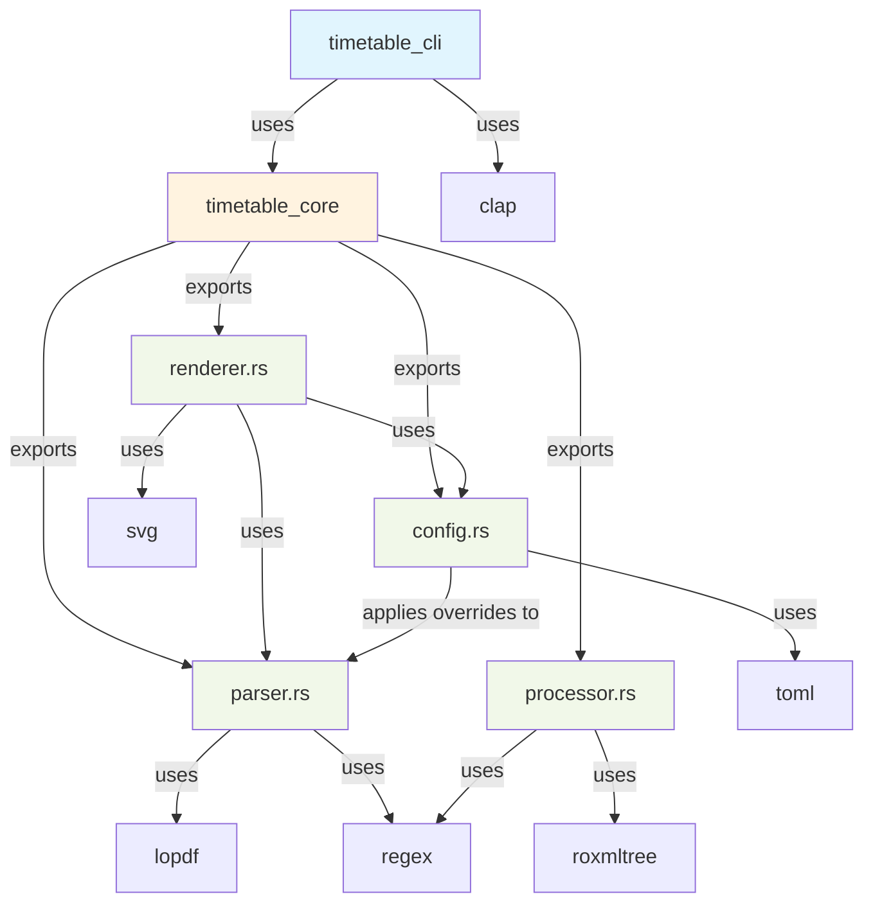
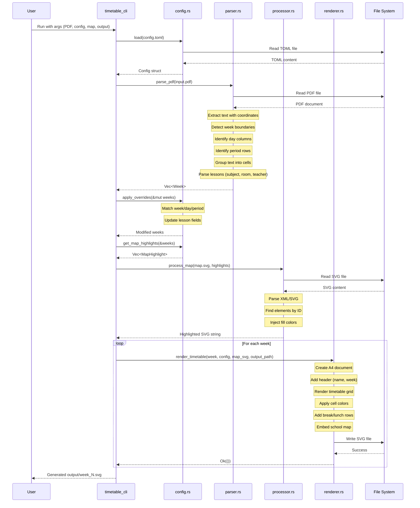
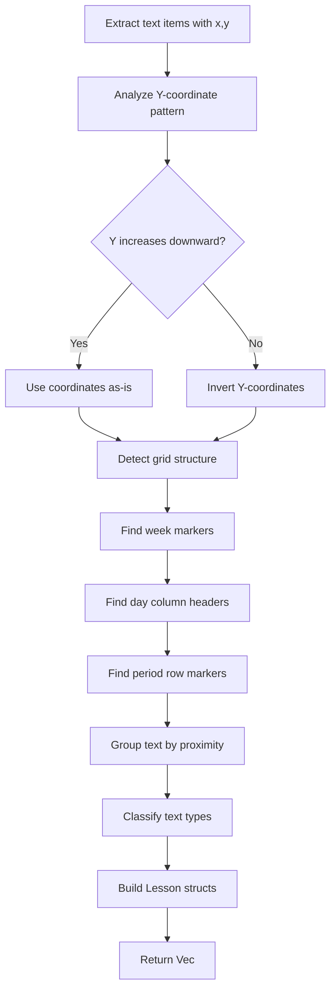

# Architecture

This document describes the high-level architecture, module dependencies, data flow, and key design decisions for the Bromcom Timetable Formatter project.

## Table of Contents

- [Workspace Structure](#workspace-structure)
- [Module Dependencies](#module-dependencies)
- [Data Flow](#data-flow)
- [Coordinate Detection Algorithm](#coordinate-detection-algorithm)
- [Technology Choices](#technology-choices)
- [Design Decisions](#design-decisions)

## Workspace Structure

The project is organized as a Cargo workspace with two crates:

```
bromcom-timetable-formatter/
├── Cargo.toml                    # Workspace definition
├── config.toml                   # Example configuration
├── crates/
│   ├── core/                     # Core library (business logic)
│   │   ├── Cargo.toml
│   │   └── src/
│   │       ├── lib.rs            # Module exports
│   │       ├── config.rs         # Configuration management
│   │       ├── parser.rs         # PDF parsing
│   │       ├── processor.rs      # Map SVG processing
│   │       └── renderer.rs       # SVG timetable generation
│   └── cli/                      # Command-line interface
│       ├── Cargo.toml
│       └── src/
│           └── main.rs           # CLI entry point
├── input/                        # Input PDF files
├── output/                       # Generated SVG outputs
├── resources/                    # School map SVG files
└── docs/                         # Additional documentation
    └── TODO.md                   # Roadmap and planned features
```

### Separation of Concerns

- **Core Library (`timetable_core`)**: Contains all business logic, making it reusable
  in other contexts (e.g., web service, GUI application)
- **CLI Binary (`timetable_cli`)**: Thin wrapper that handles argument parsing and
  orchestrates core library calls

## Module Dependencies



## Data Flow

The complete pipeline from PDF input to SVG output follows this sequence:



### Step-by-Step Data Transformation

1. **Input**: Bromcom PDF with text positioned using coordinates
2. **Parser Output**: `Vec<Week>` containing `Vec<Lesson>` with structured data
3. **Config Application**: Overrides modify specific lessons by week/day/period
4. **Map Highlights**: Config maps room codes → colors → map element IDs
5. **SVG Generation**: Renderer creates formatted timetable + embedded highlighted map
6. **Output**: One SVG file per week, ready for printing

## Coordinate Detection Algorithm

The parser uses coordinate-based heuristics to reconstruct the timetable grid from PDF text:

### Overview

Bromcom PDFs contain text items with `(x, y)` coordinates but no explicit table structure. The parser must:

1. Detect week boundaries
2. Identify day columns (Monday-Friday)
3. Identify period rows (PD, L1-L5)
4. Group nearby text into cells
5. Classify text as subject/room/teacher

### Y-Direction Auto-Detection

Different PDFs may have Y-coordinates that increase downward or upward. The parser:

1. Extracts all text items with coordinates
2. Analyzes the Y-coordinate distribution
3. Detects if Y increases or decreases down the page
4. Normalizes all coordinates to a consistent orientation



### Text Grouping Tolerances

Text items are grouped into the same cell if they are within tolerance:

- **X-axis tolerance**: ±45px (horizontal proximity)
- **Y-axis tolerance**: ±25px (vertical proximity)

These values were tuned empirically for Bromcom PDFs and may need adjustment for other formats.

### Pattern Matching

The parser uses regex patterns to classify text:

- **Room code**: `^[A-Z]{2,}\d+.*$` (e.g., MA3, SC8, HU5)
- **Teacher name**: `^(Mr|Ms|Mrs|Miss)\s+.*$`
- **Period**: `^(PD|L[1-5]|Reg)$`
- **Day**: `Monday|Tuesday|Wednesday|Thursday|Friday`
- **Week**: `Week\s+(\d+)`

Everything else is considered a subject name.

### Limitations

- Relies on fixed tolerance values (may fail with different layouts)
- Assumes standard Bromcom format circa 2025
- Cannot handle merged cells or complex table structures
- May misclassify text if formatting is unusual

## Technology Choices

### PDF Parsing: `lopdf`

**Why `lopdf`?**
- Low-level access to PDF structure
- Can extract text with precise coordinates
- Rust-native, no external dependencies
- Actively maintained

**Alternatives Considered**:
- `pdf-extract`: Higher-level but less control over coordinates
- `pdfium-render`: Requires C++ bindings, heavier dependency

**Trade-offs**:
- Requires manual text extraction and decoding
- Need to handle Bromcom-specific character encoding (+29 offset)
- More complex but provides necessary coordinate data

### SVG Generation: `svg` crate

**Why `svg` crate?**
- Simple, declarative API for building SVG documents
- Type-safe element construction
- Lightweight, pure Rust

**Alternatives Considered**:
- Direct string templating: Error-prone, no safety
- `resvg`: More for rendering SVGs, not creating them

**Trade-offs**:
- Limited to programmatic SVG generation
- Cannot directly manipulate existing SVG content (need `roxmltree` for that)

### SVG Manipulation: `roxmltree`

**Why `roxmltree`?**
- Fast, read-only XML/SVG parser
- Zero-copy parsing for efficiency
- Provides DOM-like tree traversal

**Alternatives Considered**:
- `quick-xml`: Lower-level, more complex API
- `xmltree`: Mutable but slower
- `svg-metadata`: Too specialized

**Trade-offs**:
- Read-only: Must use string manipulation to inject attributes
- No XPath or CSS selectors (manual tree traversal)
- Works well for our use case (find elements by ID, inject color)

### Configuration: `toml` + `serde`

**Why TOML?**
- Human-readable and easy to edit
- Excellent Rust ecosystem support via `serde`
- Natural mapping to Rust structs

**Alternatives Considered**:
- YAML: More complex, less type-safe
- JSON: Less human-friendly for config files
- RON: Less widely known

### Command-Line Parsing: `clap`

**Why `clap`?**
- Derive-based API reduces boilerplate
- Automatic help text generation
- Industry standard for Rust CLIs

## Design Decisions

### Why Coordinate-Based Parsing?

Bromcom PDFs don't preserve semantic table structure—only text with positions. Coordinate-based parsing is the only reliable way to reconstruct the grid.

### Why Separate Core Library?

- **Reusability**: Core logic can be used in web services, GUIs, or other contexts
- **Testability**: Business logic can be tested independently of CLI
- **Maintainability**: Clear separation of concerns

### Why Configuration Overrides?

PDF parsing is inherently brittle. Overrides allow users to:
- Correct parsing errors without modifying code
- Handle special cases (substitute teachers, room changes)
- Work around format variations

### Why Embed Maps in SVG?

- **Single-file output**: Easier to distribute and print
- **Self-contained**: No need to manage separate image files
- **Scalable**: SVG maps scale without quality loss

### Why A4 Dimensions?

- Standard paper size in UK (where Bromcom is commonly used)
- Matches typical school printing infrastructure
- Easy to calculate layout at 210mm × 297mm (794px × 1123px at 96 DPI)

### Why Rust?

- **Performance**: Fast PDF parsing and SVG generation
- **Safety**: No null pointer errors, memory leaks, or data races
- **Ecosystem**: Excellent crates for PDF, SVG, and config handling
- **Cross-platform**: Easy to compile for Linux, macOS, Windows, FreeBSD

### Future Architectural Considerations

See [docs/TODO.md](docs/TODO.md) for planned enhancements, including:

- Web service API (REST endpoints)
- Interactive HTML output (replace static SVG)
- Format detection (support non-Bromcom PDFs)
- Plugin system (community-contributed parsers)

---

For implementation details, see the rustdoc API documentation:

```bash
cargo doc --open --no-deps
```
